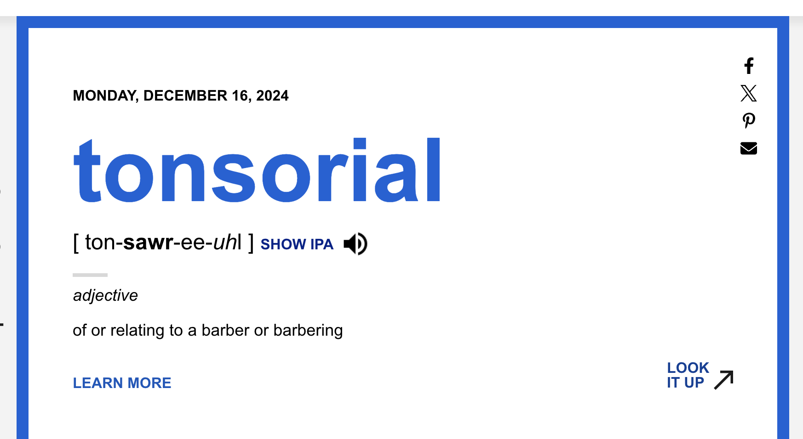

# Minimum Viable Product
Since I am creating a visual dictionary database thing. The main things the user will be inputting is:
## Design
### Main Info Card
There should be a card showing the main thing a user wants to remember. A title like the following image:

*Figure 1 - Image of Word (dictionary.com, 2024)*

This shows the main priority, but I will be adding the image as well. Technically speaking this application is like a notetaking app, but where it shines is how it presents the info. Hence, Visualnary. I'll be taking the commonly used features thats often boring and add visual aid to compliment this project.

### Search Bar
Here we have two search bars to choose from. One from Dictionary.com and the other from Oxford Doctionary. I think choosing the sharp edges can put this project apart from the round cornered enthusiasts. 

*Figure 2 - Search Bar (dictionary.com, 2024)*

*Figure 3 - Search Bar (oxford dictionary, 2024)*

### Colour Scheme
I think focussing on dark mode shall be the first choice. 

## Database
There are 3 pioneers in database today; PostgreSQL, MySQL and SQLite. 
### Extra
- Time added
- Time updated
- Application Data 
- 
### User Inputs
- Title
- Short Description
- Picture
  
